# observability-opentelemetry
Observability with OpenTelemetry and Grafana.

* For this demo on how to use OpenTelemetry with Grafana this is the basic schema of the project.

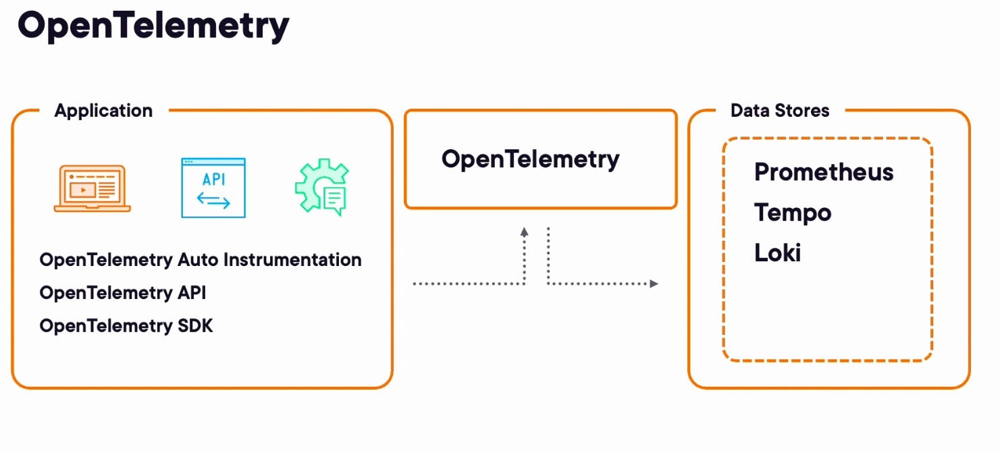

* Application consists out of 2 ASP.NET Web API services and 1 Service worker. The communication between the services is done with RabbitMQ, the Basket API will push a message to the queue and the Service worker will pick this up and process it.
The processing of the message will trigger 2 calls to the Catalog API.

* Logging is done with SeriLog, and it uses an OpenTelemetry Sink to export logs to an OpenTelemetry Collector.
Traces are collected using the OpenTelemetry auto instrumentation for .NET.
<br/>

The source code of the .NET projects can be found into the Otel-Backend folder.
<br/>

*  Infrastructure of the project is deployed via a docker compose file setting up an observability environment with following elements:<br/><br/>
  * - Blackbox : for probing endpoints <br/>
  * - Prometheus : collecting metrics of the Blackbox probes <br/>
  * - Loki : logging aggregator for all logs generated by the .NET projects <br/>
  * - Tempo : span and trace aggregator generated by the .NET projects <br/>
  * - Grafana : used for all overviews through dashboards <br/>
  * - RabbitMQ : as message queue for distributed message handling between the .NET projects <br/><br/>

The infrastructure setup files can be found into the Otel-Infrastructure folder.

# Instrumenting 

* Adding Health check endpoint to our .NET application, this is the endpoint where BlackBox will hit it every five seconds to check if the application is responding fast, or even if is death and in such case we could set up an alarm to inform us.

To do that, me add the following piece of code to our Main class in program.cs

```bazaar
app.MapHealthChecks("/health", new HealthCheckOptions
        {
            AllowCachingResponses = false,
            ResultStatusCodes =
                {
                    [HealthStatus.Healthy] = StatusCodes.Status200OK,
                    [HealthStatus.Degraded] = StatusCodes.Status200OK,
                    [HealthStatus.Unhealthy] = StatusCodes.Status503ServiceUnavailable
                }
        });
```

We also need to add these imports to program.cs

```bazaar
using Microsoft.AspNetCore.Diagnostics.HealthChecks;
using Microsoft.Extensions.Diagnostics.HealthChecks;
```

* In the docker-compose file we have a section where we deploy and configure blackbox.

```bazaar
  blackbox:
    # https://github.com/prometheus/blackbox_exporter/releases
    image: prom/blackbox-exporter:v0.23.0
    container_name: blackbox
    restart: unless-stopped
    ports:
      - 9115:9115
    volumes:
      - /etc/localtime:/etc/localtime:ro
      - ./blackbox/blackbox.yml:/etc/blackbox/blackbox.yml
    command: --config.file=/etc/blackbox/blackbox.yml
    networks:
      otel:
```
We are exposing BlackBox on the port 9115 and using the configuration file ./blackbox/blackbox.yml <br>

* Also in the docker-compose file we are deploying Prometheus:

```bazaar
  prometheus:
    # https://github.com/prometheus/prometheus/releases
    image: prom/prometheus:v2.43.0
    container_name: prometheus
    hostname: prometheus
    restart: unless-stopped
    ports:
      - 9090:9090
    volumes:
      - /etc/localtime:/etc/localtime:ro
      - ./prometheus/prometheus.yml:/etc/prometheus/prometheus.yml
      - prometheus:/prometheus
    depends_on:
      - blackbox
    networks:
      otel:
```

We are exposing Prometheus on the port 9090 abd taken as the configuration file ./prometheus/prometheus.yml<br/>
Is here were we indicate to Prometheus to scrap the health metrics from the endpoint we defined in our .NET code:

```bazaar
scrape_configs:
  - job_name: 'blackbox'
    scrape_interval: 5s
    metrics_path: /probe
    params:
      module: [http_2xx]  # Look for a HTTP 200 response.
    static_configs:
      - targets:
        - http://host.docker.internal:6001/health #Catalog API
        - http://host.docker.internal:6002/health #Basket API
    relabel_configs:
      - source_labels: [__address__]
        target_label: __param_target
      - source_labels: [__param_target]
        target_label: instance
      - target_label: __address__
        replacement: blackbox:9115
  - job_name: 'otel-collector'
    scrape_interval: 10s
    static_configs:
    - targets: ['otel-collector:8889']
    - targets: ['otel-collector:8888']
```

And also, we are indicating Prometheus to scrap metrics from the OpenTelemetry Collector

* To visualize the metrics available in Prometheus, we are using Grafana.<br>
and this is the section in the docker-file where we deploy Grafana:

```bazaar
  grafana:
    # https://github.com/grafana/grafana/releases
    image: grafana/grafana:9.4.7
    container_name: grafana
    #command:
    environment:
      - GF_AUTH_ANONYMOUS_ENABLED=true
      - GF_AUTH_ANONYMOUS_ORG_ROLE=Admin
      - GF_AUTH_DISABLE_LOGIN_FORM=true
    volumes:
      - /etc/localtime:/etc/localtime:ro
      - grafana-data:/var/lib/grafana
      - ./grafana/provisioning:/etc/grafana/provisioning
    restart: unless-stopped
    ports:
      - 3000:3000
    depends_on:
      - prometheus
      - tempo
      - loki      
    networks:
      otel:
```

We are exposing Grafana on the port 3000. And also, we are configuring Grafana to allow us login without ask for user and password, this should be removed in a no-demo environment.

```bazaar
- GF_AUTH_ANONYMOUS_ENABLED=true
- GF_AUTH_ANONYMOUS_ORG_ROLE=Admin
- GF_AUTH_DISABLE_LOGIN_FORM=true
```

The configuration we are applying for Grafana is defined in the directory ./grafana/provisioning

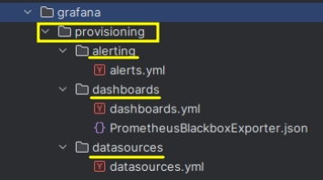

In datasources.yml file is where we are setting up the connections with Prometheus, Loki and Grafana. And remember that the data that Prometheus is receiving is coming from the OpenTelemetry Collector that is shown above in the file ./prometheus/prometheus.yml.<br/>
This is the content of the file datasources.yml creating the connections with Prometheus, Loki and Grafana:

```bazaar
#https://grafana.com/docs/grafana/latest/administration/provisioning/
apiVersion: 1

datasources:
- name: Prometheus
  type: prometheus
  uid: prometheus
  access: proxy
  url: http://prometheus:9090
  jsonData:
    timeInterval: 10s
  basicAuth: false
  isDefault: true
  version: 1
  editable: false

- name: Tempo
  type: tempo
  uid: tempo
  access: proxy
  url: http://tempo:3200
  basicAuth: false
  isDefault: false
  version: 1
  editable: false

- name: Loki
  type: loki
  uid: loki
  access: proxy
  url: http://loki:3100
  basicAuth: false
  isDefault: false
  version: 1
  editable: false
  jsonData:
    derivedFields:
      - datasourceUid: tempo
        matcherRegex: "\u0022traceid\u0022:\u0022(\\w+)\u0022"
        name: TraceId
        url: '$${__value.raw}'
```

* To start our tooling environment we do it using the docker-compose.yaml file provided.

```bazaar
sudo docker compose -f ./docker-compose.yml up -d
```

* To stop our tooling environment we can use this command:

```bazaar
sudo docker compose -f ./docker-compose.yml down
```

Once we have running our infrastructure these are the most relevant addresses and ports:

  * blackbox exporter --> http://localhost:9115/

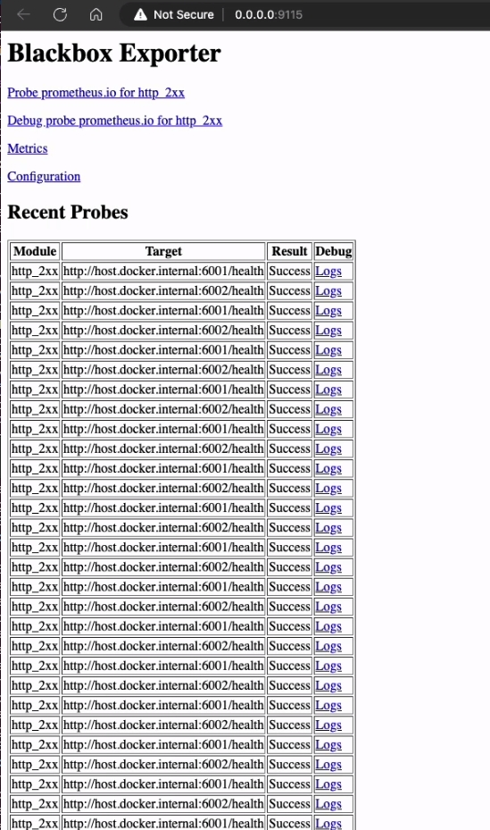

  * prometheus --> http://localhost:9090

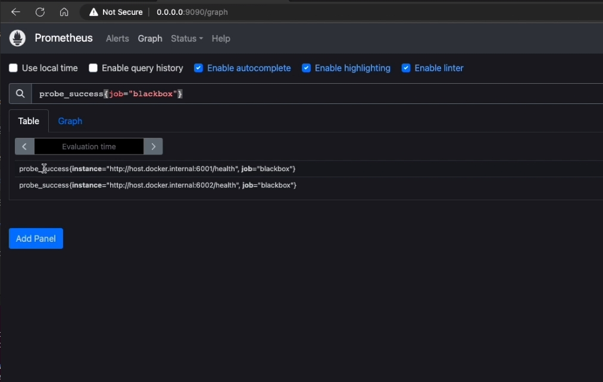

  * grafana --> http://192.168.1.117:3000

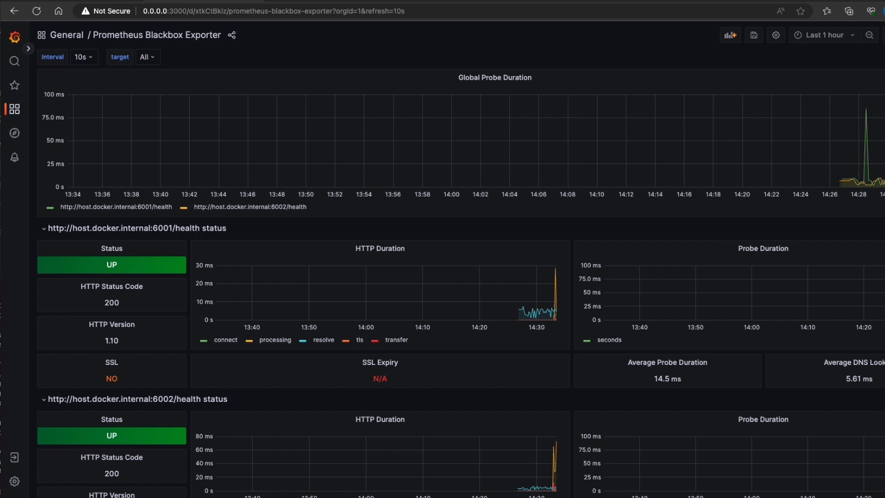

When getting started with OpenTelemetry you can send your telemetry data directly to a telemetry backend, 
either in the OpenTelemetry format or in a vendor-specific format. <br>
This is a great way to have a quick start and does not require a lot of 
setup other than configuring the OpenTelemetry SDK to send the data to the backend. <br/>
However, in a production environment, you will want to use a collector as it will 
reduce the load on your application and move the complexity of working with telemetry data out of the services.<br/>
The collector will allow you to do additional handling like retries, batching encryption or even sensitive data filtering. <br/>
It will also allow you to send your data to multiple backends at the same time in different formats. <br/>
The collector consists out of different components, each with its own responsibility. It can be configured 
to use only the components that are needed for your specific use of case, this way, you can keep the footprint of your collector 
as small as possible. <br/>
Configuring which components to use is done through a yaml configuration file. The collector will read this configuration file at startup, 
and it will configure itself accordingly. <br/>
The main components of the collector are:
 - [Receivers](https://github.com/open-telemetry/opentelemetry-collector/blob/main/receiver/README.md)
 - [Processors](https://github.com/open-telemetry/opentelemetry-collector/blob/main/processor/README.md)
 - [Exporters](https://github.com/open-telemetry/opentelemetry-collector/blob/main/exporter/README.md)
 - [Extensions](https://github.com/open-telemetry/opentelemetry-collector/blob/main/extension/README.md)
 - [Pipelines](https://opentelemetry.io/docs/collector/configuration/#:~:text=A%20pipeline%20consists%20of%20a,in%20more%20than%20one%20pipeline.)

**Receivers, processors and exporters can access the telemetry data through pipelines. <br/>
<br/>
Pipelines define how telemetry data flows through the collector, from what source it is received, in what format, which processors are 
applied to de data, and to what destination it is exported again and in what format, allowing us to transform the data in any way we want. <br/>**
<br/>
This otel.yml is the file that we are using for configuring the OpenTelemetry Collector, indicating the receivers, exporters, extensions, 
processors that we want to use, and the pipeline:

```bazaar
receivers:
  otlp:
    protocols:
      grpc:
      http:

exporters:
  prometheus:
    endpoint: otel:8889
  otlp:
    endpoint: tempo:4007
    tls:
      insecure: true
  loki:
    endpoint: http://loki:3100/loki/api/v1/push
    tls:
      insecure: true

extensions:
  health_check:
  zpages:
     endpoint: otel:55679

processors:
  # Data sources: traces, metrics, logs
  batch:

service:
  extensions: [zpages, health_check]  # Enable zpages
  pipelines:
    metrics:
      receivers: [otlp]
      exporters: [prometheus]
    traces:
      receivers: [otlp]
      processors: [batch]
      exporters: [otlp]
    logs:
      receivers: [otlp]
      processors: [batch]
      exporters: [loki]
```
And this is our section in the docker-compose.yml file where we deploy the OpenTelemetry collector:

```bazaar
  otel-collector:
    # https://github.com/open-telemetry/opentelemetry-collector-contrib/releases
    container_name: otel
    hostname: otel
    image: otel/opentelemetry-collector-contrib:0.75.0
    command: ["--config=/etc/otel-collector-config.yaml"]
    volumes:
      - ./otel/otel.yml:/etc/otel-collector-config.yaml
    restart: unless-stopped
    ports:
      - 8888:8888   # Prometheus metrics exposed by the collector
      - 8889:8889   # Prometheus exporter metrics
      - 4317:4317   # OTLP gRPC receiver
      - 9200:55679  # zpages
      - 13133:13133 # Health check
    networks:
      otel:
```

A good way to actually verify the running collector is by using the zpages extension. <br/>
Open your browser and go to http://localhost:9200/debug/extensionz you should be able to see the extensions 
that are active in the collector, or you can navigate to http://localhost:9200/debug/servicesz it will 
give an overview of the collector services and quick access to the other available pages:

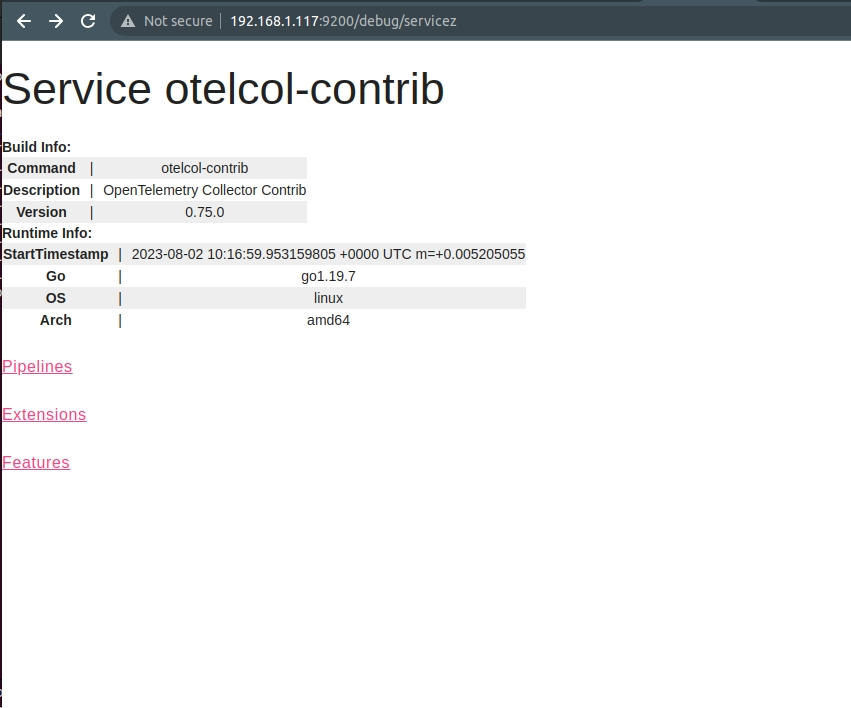

* Messaging service, to show the real power of OpenTelemetry we are also integrating in this demo a distributed 
messaging queue into our service-oriented architecture. We will be using RabitMQ in our demo, but any other message 
queuing system can be used if is supported by OpenTelemetry. <br/>
The OpenTelemetry SDK will **automatically** instrument (auto-instrumentation) the message queuing system so that we can understand 
the data flow.
<br/><br/>
We can see in the docker-compose-yml file how are we deploying rabitmq:

```bazaar
  rabbitmq:
    # https://github.com/docker-library/rabbitmq
    image: rabbitmq:3.11.0-management-alpine
    container_name: rabbitmq
    restart: unless-stopped
    ports:
      - 5672:5672
      - 15672:15672
    networks:
      otel:
```

We can access to the UI of RabbitMQ in http://localhost:15672/, with the user guest and password guest:

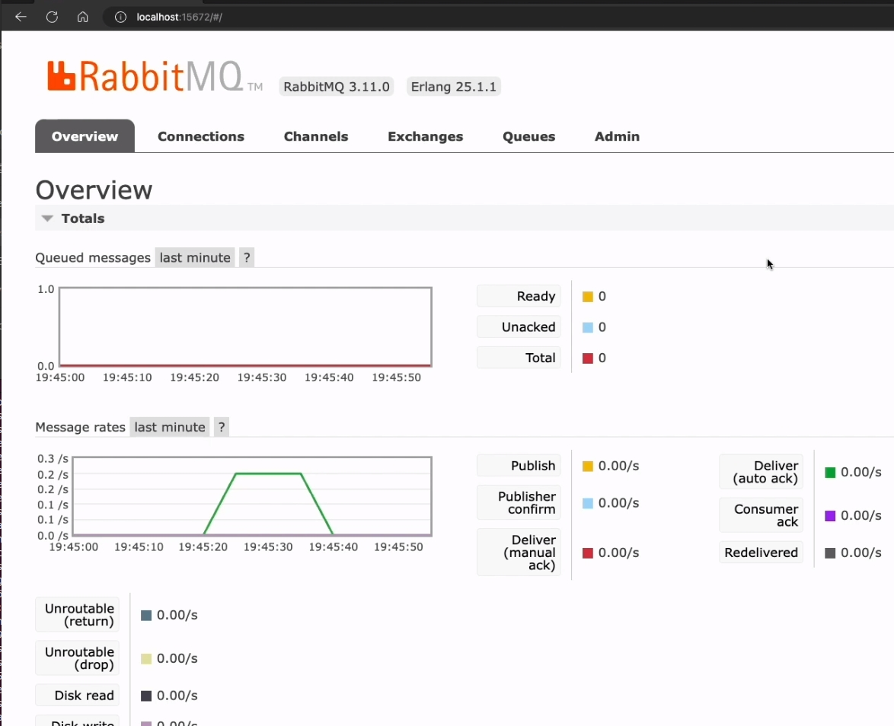

# Instrumenting application to expose logs to OpenTelemetry

In our .NET application we are going to use [Serilog](https://serilog.net/), it's a popular logging libraryfor .NET that 
is very flexible and can be configured to log to different destinations, it can log to the console, to a file, to a database, 
and, of course, to OpenTelemetry in the OTLP format.
<br/><br/>
For Serilog to be able to use OpenTelemetry we need to configure it. This is done  setting up the web application builder in the program.cs 
file for both, the Basket and the Catalog API.

```bazaar
builder.Host.UseSerilog((hostingContext, loggerConfiguration) => loggerConfiguration
            .ReadFrom.Configuration(hostingContext.Configuration)
            .WriteTo.OpenTelemetry(options =>
            {
                options.Endpoint = $"{Configuration.GetValue<string>("Otlp:Endpoint")}/v1/logs";
                options.Protocol = Serilog.Sinks.OpenTelemetry.OtlpProtocol.GrpcProtobuf;
                options.ResourceAttributes = new Dictionary<string, object>
                {
                    ["service.name"] = Configuration.GetValue<string>("Otlp:ServiceName")
                };
            }));
```

Note that from the point of view of the application we are not aware that will be using Loki as our logging aggregator, the only configuration that we have done 
is redirect the logs to the OpenTelemetry Collector. This is one of the benefits of using OpenTelemetry, we are not tied to a specific backend.

Now that we have everything in place to collect the logs of our application, we can go to Grafana http://localhost:3000 click in Explore and select Loki. <br/>
You should be able to see the logs of the application coming from the OTLC Exporter:

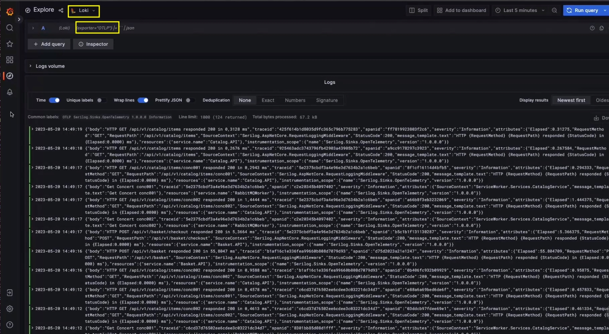

# Collecting traces with OpenTelemetry auto instrumentation

Getting started with tracing is very similar to getting started with logging, we will be using the OpenTelemetry collector to receive the traces and export them to Tempo. <br/>
The only difference is that we will be using the **built-in** capabilities of the OpenTelemetry SDK and its instrumentation that is available for .NET instead of using a third-party 
library like Serilog. <br/>
<br/>
In the Program.cs file we first hook up the OpenTelemetry SDK to the ResourceBuilder:

```bazaar
Action<ResourceBuilder> appResourceBuilder =
            resource => resource
                .AddTelemetrySdk()
                .AddService(Configuration.GetValue<string>("Otlp:ServiceName"));
```

Next we add the tracing configuration:

```bazaar
builder.Services.AddOpenTelemetry()
            .ConfigureResource(appResourceBuilder)
            .WithTracing(builder => builder
                .AddAspNetCoreInstrumentation()
                .AddHttpClientInstrumentation()
                .AddSource("APITracing")
                //.AddConsoleExporter()
                .AddOtlpExporter(options => options.Endpoint = new Uri(Configuration.GetValue<string>("Otlp:Endpoint")))
            )
```

Depending on what kind of information you want to get in your trace data, you can provide extra instrumentation extension methods. Since 
the Basket and Catalog services are asp.net web APIs, we will be using the ASP.NET Core and HttpClient instrumentation extension methods:

```bazaar
WithMetrics(builder => builder
                .AddRuntimeInstrumentation()
                .AddAspNetCoreInstrumentation()
                .AddOtlpExporter(options => options.Endpoint = new Uri(Configuration.GetValue<string>("Otlp:Endpoint"))));
```

What is important to notice is the fact that we are again only linking the OpenTelemetry collector:

```bazaar
AddOtlpExporter(options => options.Endpoint = new Uri(Configuration.GetValue<string>("Otlp:Endpoint")))
```

We are not aware of the fact that we will be using Tempo as our tracing backend.<br/>
So the same level of abstraction as with logging applies here as well.

**If the application's developers ever decide to switch out Tempo for another tracing backend, we can do it without having 
to change anything in the application.**

Now, we can open Grafana http://localhost:3000 click on Explore and select Tempo, we should be able to see traces and spans 
of the data flowing across the distributed system.

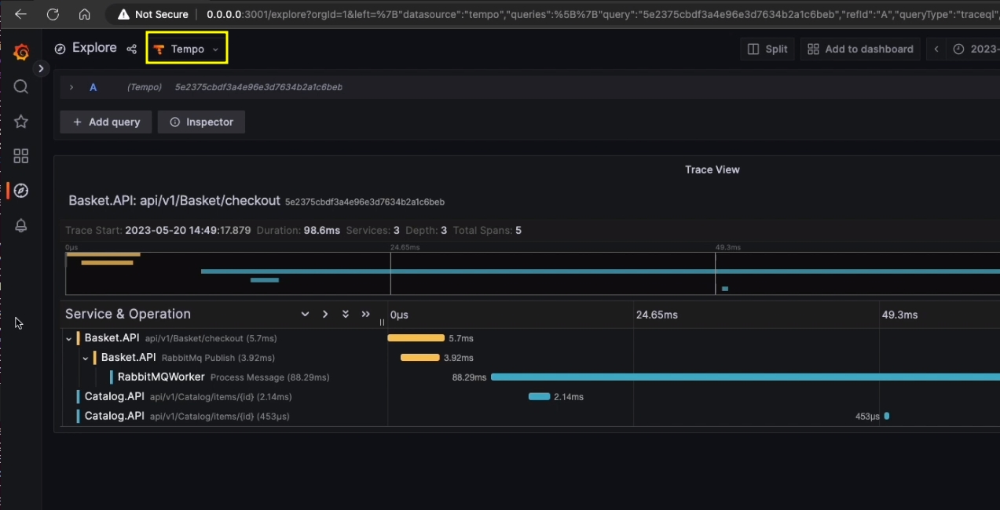

We have seen how we can add observability to our application by adding logging and tracing to our microservices. <br/> 
We have seen how we can use the OpenTelemetry SDK to add this functionality to our code and how we can use the OpenTelemetry collector to send 
the data to the different back ends. <br/>
<br/>
So we have covered the tree pillars of observability using OpenTelemetry.

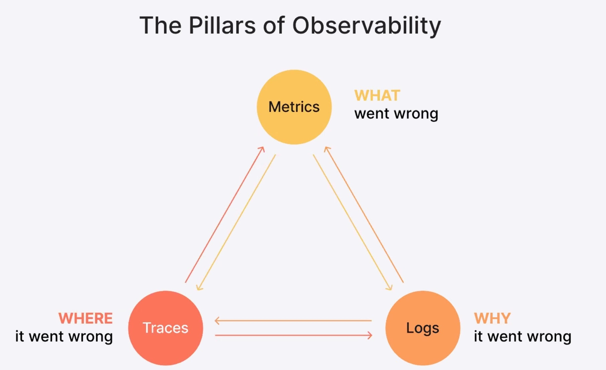

* We added **Metrics** using BlackBox exporter, which gives us metrics about the health of our application, not only letting us know if microservices are 
up or down, but also giving us information about the time that the requests take, and in this way, we can anticipate certain grade of degradation if 
this happens. <br/>
This information is shown in Grafana dashboard called blackbox exporter. <br/>


* We added **Logs** using the library Serilog which is able to send logs to multiple endpoints, between those, to the OpenTelemetry collector. <br/>
And we configured Grafana to use Loki to recollect the logs that it is scrapping from OpenTelemetry exporter.


* And finally, we added **traces** using the OpenTelemetry SDK using its auto-instrumentation feature for .NET, allowing us to configure Grafana to use Loki 
scrapping the data directly from the OTLP Exporter.
<br/><br/>
We can see how we have configured this flow in our pipeline section of our yaml file otel.yml:

```bazaar
  pipelines:
    metrics:
      receivers: [otlp]
      exporters: [prometheus]
    traces:
      receivers: [otlp]
      processors: [batch]
      exporters: [otlp]
    logs:
      receivers: [otlp]
      processors: [batch]
      exporters: [loki]
```

Also, we can see the pipeline in a more visual way visiting the OpenTelemetry zpages extension that we enabled it http://loalhost:9200/debug/servicez

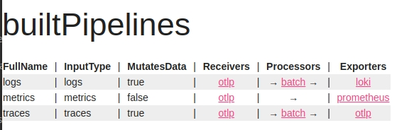

# OpenTelemetry Finer Detail

* Sidecar Pattern

A principle that is often used in service‑oriented architecture is the sidecar pattern. The goal with microservices is to provide isolation and encapsulation of functionality, providing 
separation of concerns, and making a microservice self‑contained. However, there are some concerns that are cross‑cutting, such as logging, monitoring, or security. <br/>
<br/>
The sidecar pattern is a way to provide extra support and functionality to a microservice without adding them to the microservice itself. <br/>
This allows the microservice to focus on its core logic, while the sidecar provides additional functionality. From a container environment perspective, the sidecar pattern is implemented 
by attaching a sidecar container to the main container. This will be presented to the outside world as a whole, in other words as one microservice, but internally, it will be composed of 
two containers, each handling their own concerns.
<br/><br/>
This could be the picture of what we are talking about in the upper text:

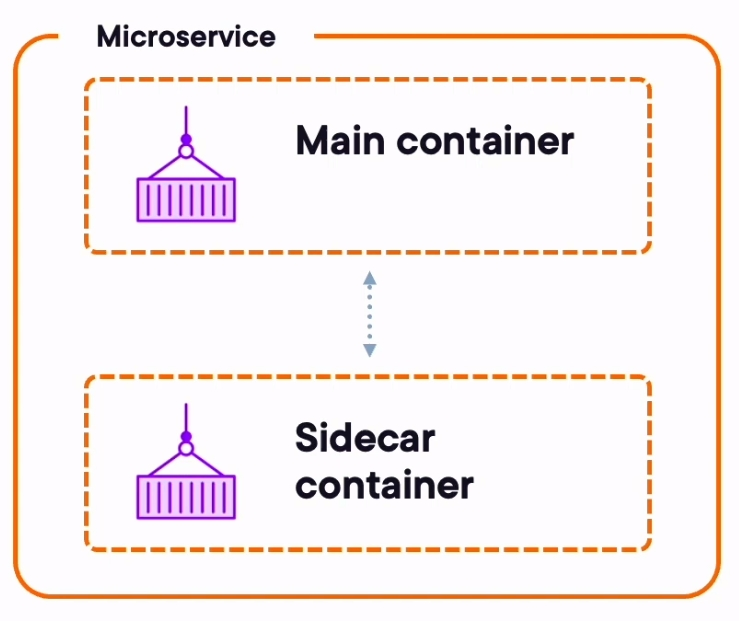

In regard to our observability setup, this means that we add an OpenTelemetry collector as a sidecar to each of our microservices. Those collectors in turn will send the telemetry data to 
a central OpenTelemetry collector that will forward the data to the configured backends. <br> 
The reason for this setup, besides the obvious sidecar pattern benefits mentioned above, is that we now no longer have a central collector that needs to handle all telemetry functionality 
for all the microservices. <br/> 
Every single collector that is deployed as a sidecar can now handle specific concerns for that microservice, such as adding additional attributes or filtering out certain telemetry data, 
reducing the processing load on the central collector and, as such, gaining performance.
<br/><br/>
And this could be the picture of our Observability solution using the Sidecar Pattern:

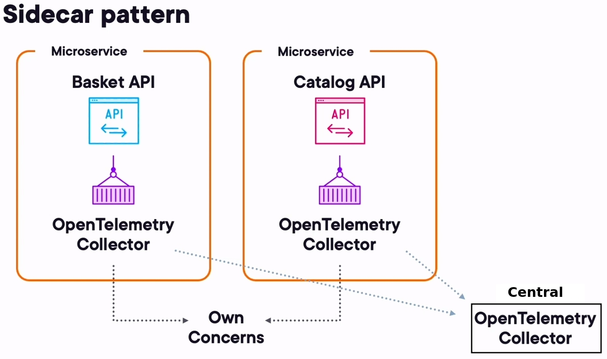


